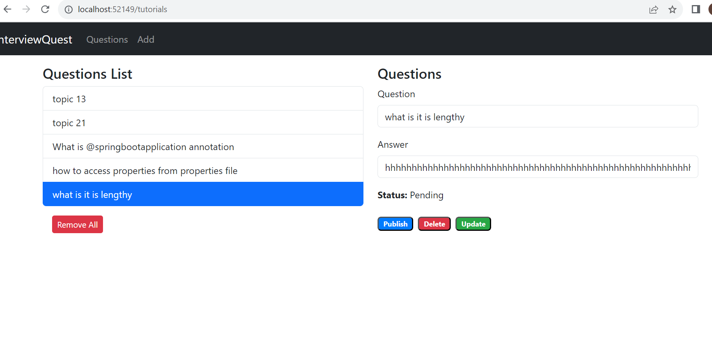

# interviewquest

To store the data in Firebase, you have to add your Firebase credentials in environments/environment.ts file.
Once It's done, you can see your added records in Firebase Realtime databse section.

# interviewquest
